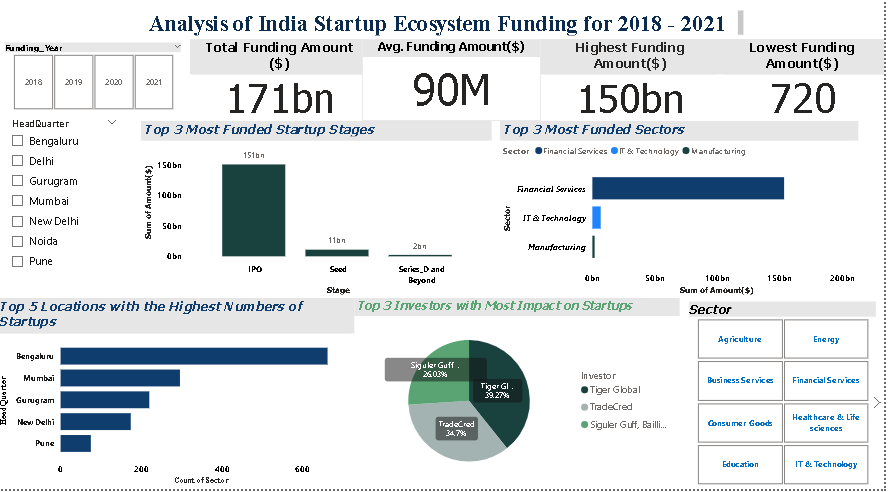

PROJECT TITLE
Analyzing the india startup ecosystem

PROJECT DESCRIPTION
This dataset provides comprehensive information about the Indian startups ecosystem, including details on startup companies, their founders, funding stages, investors, Sectors,locations and more. The aim is to offer insights into the growth, trends, and key players within the Indian startup landscape.

DATA SOURCE
open database
csv_files
one_Drive

DATA COLLECTION METHODOLOGY
Data was collected using a combination of python libraries such as pyodbc which was used as connection to an sql database source and pandas to read the csv_files. pandas was also used in the processing of the data.Certain assumptions were made regarding company categorizations, and there may be limitations due to incomplete or inconsistent data from various sources.

SET UP
Install all the necessary libraries like pandas, numpy, matplotlib, plotly
2.Install pyodbc - a package for creating connection strings to your remote database

3.Install python-dotenv - a package for creating environment variables that will help you hide sensitve configuration informantion such as database credentials and API keys

4.Import all the necessary libraies

a.pyodbc (for creating a connection)

b.python-dotenv (loading environment variables)
5.Now create a file called .env in the root of your project folder (Note, the file name begins with a dot)

6.In the .env file, put all your sensitive information like server name, database name, username, and password

DATASET STRUCTURE
- 'Company_Brand`: Name(s) of the startup (String)
- `founders`: Name(s) of the founder(s) (String)
- `founded`: Year the startup was founded (Datetime)
- `Sector`: Industry sector of the startup (String)
- `HeadQuarter`: City where the startup is based (String)
- `amount`: Total funding received by each startups in US dollars (Float)
- `Stage`: This is the funding stages for each business which ranges from the pre-seed stage to IPO (Integer)
- `investors`: List of investors (String)
- 'funding_year':The year each company got the funding 

 Deployment
 The project is available in two formats: a published report and a deployed Power BI Dashboard.

To access the Report, use the following link: https://medium.com/@assayouti.opeyemi/analyzing-the-india-startups-ecosystem-315b46805d2d

For the Deployed Dashboard, use the following link:https://app.powerbi.com/groups/me/reports/976d2ce1-7e8d-4fcb-b940-ea605d5783fd/9f5e96c308507e49a392?experience=power-bi

AUTHOR
Assayouti Zakariyah Opeyemi